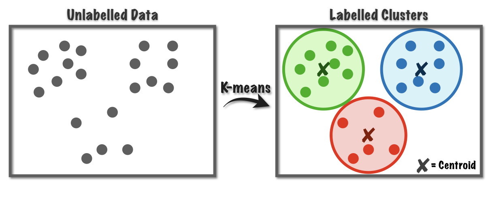

# AI/ML
- [Cross Validation](#cross_validation)
- [K-means clustering](#k_means_clustering)
- [Linear Regression](#linear_regression)
- [Moments](#moments)
- [Percentile](#percentile)
- [Polynomial Regression](#polynomial_regression)
- [R-squared](#r-squared)

## Cross Validation <a name="cross_validation"></a>
Cross Validation is a technique for evaluating a model’s performance by repeatedly splitting the data into training and testing sets to assess how well the model generalizes to unseen data. For exmaple (k-fold cross validation):

You have 100 data samples and set k = 5.  
You split the data into 5 parts of 20 samples each.  
In the first step, you train the model on 80 samples (parts 2, 3, 4, and 5) and test it on 20 samples (part 1).  
In the second step, you train on parts 1, 3, 4, and 5, and test on part 2, and so on.  
At the end, you average the results from these 5 tests to get the final evaluation.

## K-means clustering <a name="k_means_clustering"></a>
K-means is a popular unsupervised algorithm used for clustering data. Its goal is to partition a dataset into K clusters, where each data point is assigned to the nearest cluster centroid (center).


## Linear Regression <a name="linear_regression"></a> 
Fits a straight line to a data set of observations, it can be used to predict new values.

## Moments <a name="moments"></a>
- first moment - mean
- second moment - variance
- third moment - skew -  measures the asymmetry of a probability distribution, indicating whether data tails off more to the left (negative skew) or right (positive skew)
- fourth moment - kurtosis - how thick is the tail, and how sharp is the peak. Higher peaks have higher kurtosis

## Percentile <a name="percentile"></a>
Percentiles indicate how a particular value compares to the rest of a dataset by showing the percentage of values below it. For instance, being in the 75th percentile means your result is higher than 75% of all other results.

## Polynomial Regression <a name="polynomial_regression"></a>
A more curved version of linear regression (operating on higher powers of the variables), for example: ax² + bx + c. 
```python
x = np.array(pageSpeeds)
y = np.array(purchaseAmount)

p4 = np.polynomial.Polynomial.fit(x, y, 4)
```

Higher degrees provide more flexible fitting but also increase the risk of overfitting.

## R-squared <a name="r-squared"></a>
Is a statistical measure that indicates how well the regression line fits the data. It is commonly used in linear regression to assess the quality of the model. (range 0-1, 0 bad, 1 good)